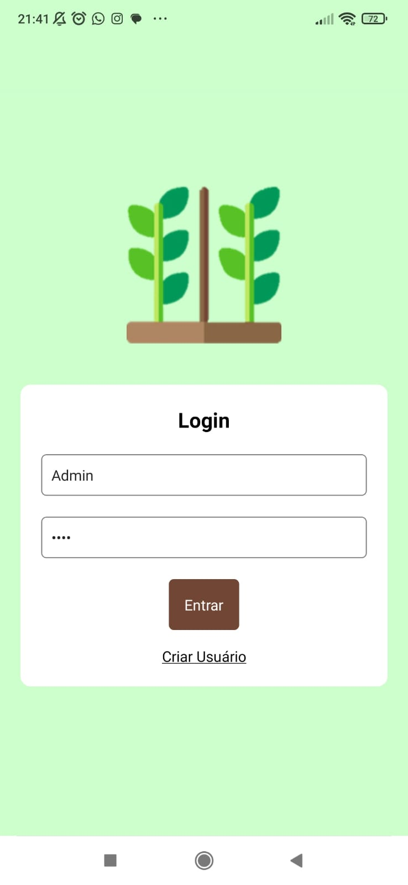
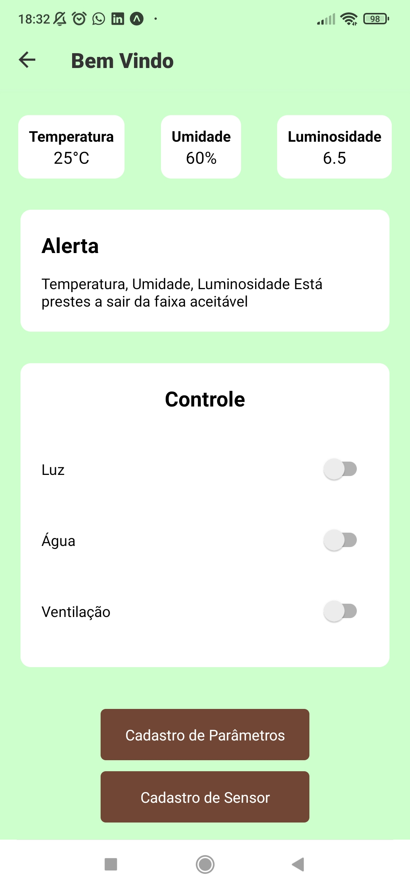
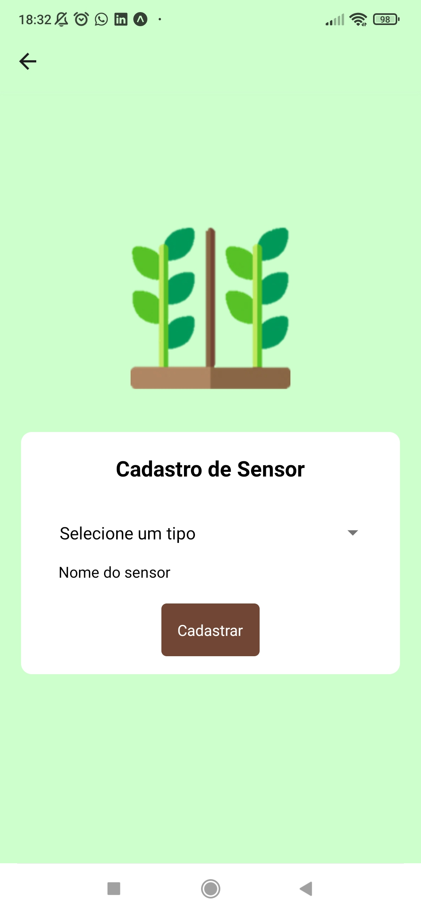
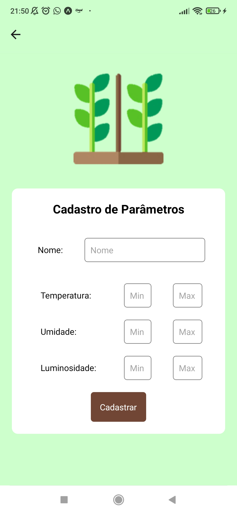

# GrowLink IoT Platform


Mobile application and backend for monitoring and automating controlled agricultural environments using **React Native, Node.js, MySQL and ESP8266**.

The project originated as a **Computer Engineering graduation project (TCC)** focused on applying IoT technologies to agricultural cultivation, and was later evolved into a functional mobile and backend platform.

---

##  Project Overview

The GrowLink platform was designed to monitor environmental conditions in agricultural greenhouses and provide automated control based on predefined parameters.

The system collects data such as temperature, humidity and luminosity, allowing users to monitor the environment through a mobile application and control connected devices.

The project combines **mobile development, backend development, database integration, cloud infrastructure and IoT hardware** in a single solution.

---

##  Android Demo

A testable Android build is available through Expo:

🌐 https://expo.dev/accounts/wellingtonamerico/projects/GrowLink/builds/feb5308f-47b1-41ea-a17e-9468769a2fa8

---

##  Screenshots

<table>
  <tr>
    <th>Login</th>
    <th>Dashboard</th>
  </tr>
  <tr>
    <td></td>
    <td></td>
  </tr>
  <tr>
    <th>Sensors</th>
    <th>Parameters</th>
  </tr>
  <tr>
    <td></td>
    <td></td>
  </tr>
</table>

---

##  Architecture

┌──────────────────────┐
│    React Native      │
│    Mobile App        │
└──────────┬───────────┘
           │
           │ HTTP / API
           ↓
┌──────────────────────┐
│    Node.js + Express │
│       Backend        │
└──────────┬───────────┘
           │
           │ Sequelize
           ↓
┌──────────────────────┐
│     MySQL / Aiven    │
└──────────────────────┘

        IoT Layer
           │
           ↓
┌──────────────────────┐
│ ESP8266 / Arduino    │
│ Sensors & Devices    │
└──────────────────────┘

---

## Technologies

### Mobile

- React Native
- Expo SDK 49
- React Navigation
- AsyncStorage

### Backend

- Node.js
- Express
- Sequelize

### Database

- MySQL (Aiven)

### Infrastructure

- Render
- Aiven
- Expo EAS Build

### Hardware

- ESP8266
- Arduino Mega
- Sensors and connected devices

---

## Estrutura do projeto

```text
mobile/
backend/
hardware/
docs/
```

---

## Features

- User authentication
- User registration
- Sensor registration
- Parameter configuration
- Temperature monitoring
- Humidity monitoring
- Luminosity monitoring
- Device control
- Automatic alerts
- MySQL database integration
- Mobile dashboard for environmental monitoring

---

## API

Backend deployed on Render:

https://growlink-iot-platform.onrender.com

Demonstration endpoint
```
GET /getUltimosValores
```

Full endpoint:
https://growlink-iot-platform.onrender.com/getUltimosValores

---

## Running Locally

### Backend

```bash
cd backend
npm install
npm start
```

### Database

Run the Sequelize migrations:
```bash
npx sequelize-cli db:migrate
```

### Mobile

```bash
cd mobile
npm install
npx expo start
```

---

## Sample Data

Example of a measurement record:
```sql
INSERT INTO Medicaos
(dataHora, medicaoLuz, medicaoUmi, medicaoTemp, userID, createdAt, updatedAt)
VALUES
(NOW(), 650, 62, 24.8, 1, NOW(), NOW());
```

---

## Project Structure

growlink-iot-platform/
│
├── mobile/
│   └── React Native application
│
├── backend/
│   └── Node.js / Express API
│
├── hardware/
│   └── ESP8266 / Arduino components
│
├── docs/
│   └── Screenshots and documentation
│
└── README.md

---

## Development Scope

The current platform demonstrates the integration of:

Mobile Application
       ↓
REST API
       ↓
Database
       ↓
IoT Environment
       ↓
Sensors & Devices

The project focuses on the integration of these layers into a single system rather than on a specific commercial agricultural deployment.

---

## Future Improvements

- MQTT integration
- JWT authentication
- Web dashboard
- Push notifications
- Real-time hardware integration
- Expanded sensor support
- More advanced environmental automation

---

## Academic Background

This project originated as the graduation project (TCC) of the Computer Engineering degree at Universidade Paulista (UNIP).

The original academic objective was to develop an automated controlled cultivation environment using sensors, actuators and a microcontroller to maintain environmental conditions according to the requirements of the cultivated plant.

---

## Autor

Wellington Américo

LinkedIn: https://www.linkedin.com/in/wellington-am%C3%A9rico/

GitHub: https://github.com/wellingtonAmerico

---

## License

This project was developed for academic and portfolio purposes.
