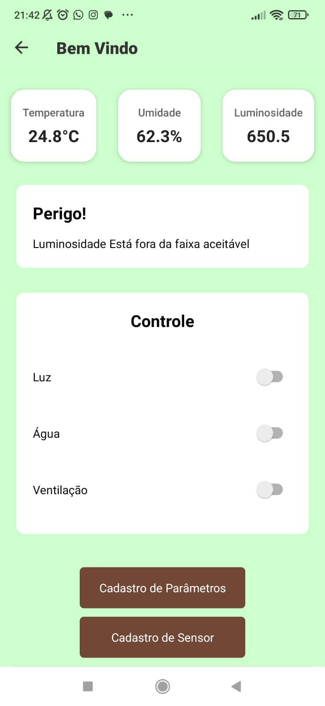
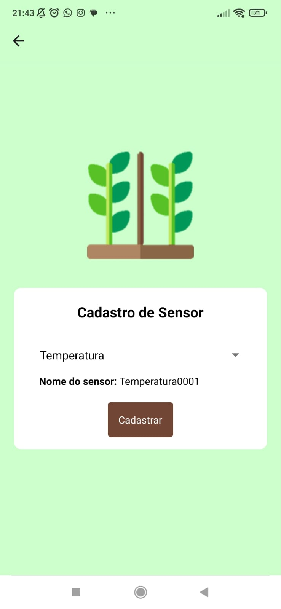
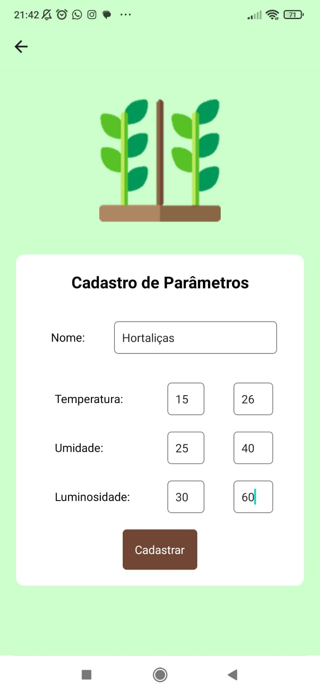

Aplicação mobile e backend para monitoramento e automação de estufas utilizando **React Native, Node.js, MySQL e ESP8266**.

## Screenshots

| Login | Dashboard |
|------|-----------|
|  |  |

| Sensores | Parâmetros |
|---------|-------------|
|  |  |

---

## Tecnologias

### Mobile
- React Native
- Expo SDK 49
- React Navigation

### Backend
- Node.js
- Express
- Sequelize

### Banco de dados
- MySQL

### Hardware
- ESP8266
- Arduino Mega

---

## Estrutura do projeto

```text
mobile/
backend/
hardware/
docs/
```

---

## Funcionalidades

- Autenticação de usuários
- Cadastro de sensores
- Cadastro de parâmetros
- Monitoramento de temperatura
- Monitoramento de umidade
- Monitoramento de luminosidade
- Controle de dispositivos
- Integração com banco MySQL

---

## Executando localmente

### Backend

```bash
cd backend
npm install
npm run dev
```

### Banco de dados

```bash
npx sequelize-cli db:migrate
```

### Mobile

```bash
cd mobile
npm install
npx expo start
```

---

## Dados de demonstração

```sql
INSERT INTO Medicaos
(dataHora, medicaoLuz, medicaoUmi, medicaoTemp, userID, createdAt, updatedAt)
VALUES
(NOW(), 650, 62, 24.8, 1, NOW(), NOW());
```

---

## Próximas melhorias

- Integração MQTT
- Deploy em nuvem
- Autenticação JWT
- Dashboard Web
- Notificações push

---

##  Autor

**Wellington Américo**