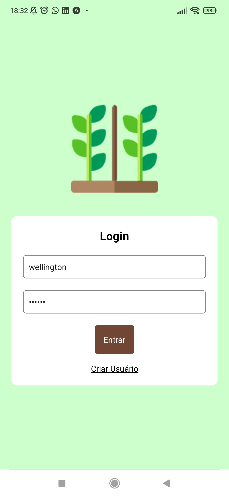
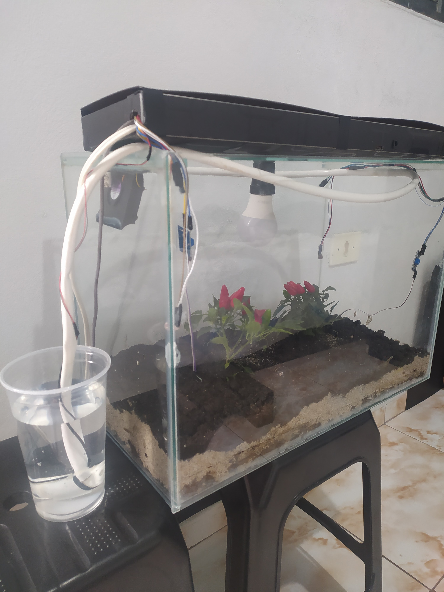
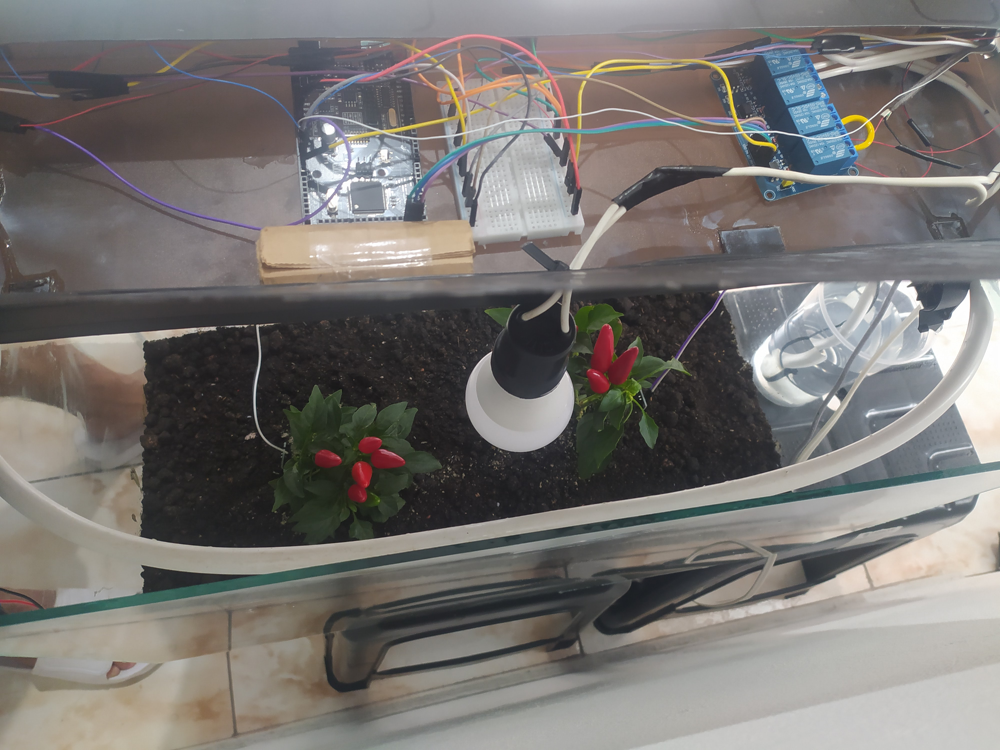

# GrowLink - IoT Platform for Smart Cultivation Automation

GrowLink is an IoT platform developed to monitor and automate small-scale cultivation environments through sensors, actuators and a mobile application.

The system combines Arduino hardware, wireless communication, a PostgreSQL database and a React application, allowing users to monitor environmental conditions and control devices remotely in real time.

---

## Overview

The platform was created as a final graduation project with the objective of applying concepts from:

* Internet of Things (IoT)
* Embedded Systems
* Mobile Development
* Database Management
* Automation and Monitoring Systems

GrowLink continuously collects environmental data and automatically controls irrigation, lighting and ventilation according to user-defined parameters.

---

## Main Features

### Environmental Monitoring

* Temperature monitoring
* Humidity monitoring
* Light intensity monitoring

### Automation

* Automatic irrigation control
* Automatic lighting control
* Automatic ventilation control

### Remote Control

Users can manually control all devices through the application:

* Turn irrigation on/off
* Turn lighting on/off
* Turn ventilation on/off

### User Management

* User registration
* Authentication system
* Personalized cultivation settings

### Data Persistence

All information is stored in PostgreSQL:

* Sensor readings
* Automation parameters
* Device status
* User accounts

---

## System Architecture

```text
User

↓

React Application

↓

PostgreSQL Database

↙           ↘

Arduino      Sensor Data

↓

Actuators

• Irrigation
• Lighting
• Ventilation
```

---

## Technology Stack

### Mobile Application

* React
* JavaScript

### Backend & Database

* PostgreSQL
* Sequelize ORM

### Hardware

* Arduino
* DHT Temperature/Humidity Sensor
* Light Sensor
* Relays
* Irrigation Pump
* Ventilation System
* Lighting System

### Infrastructure

* Wi-Fi Communication
* Git
* GitHub

---

## Project Structure

```text
growlink-iot-platform/

├── app/
│   ├── assets/
│   ├── config/
│   ├── migrations/
│   ├── models/
│   ├── views/
│   ├── App.js
│   └── package.json
│
├── arduino/
│   ├── arduino_compilation_estufa_code/
│   └── mega_compilation/
│
├── docs/
│   ├── screenshots/
│   └── prototype/
│
└── README.md
```

---

## Screenshots

### Login



### Dashboard


### Sensors Management


### Parameters Configuration


---

## Prototype

Physical prototype developed during project validation.

### Smart Greenhouse



### Hardware Assembly



---

## Key Learnings

* IoT architecture design
* Embedded systems integration
* Mobile application development
* Real-time monitoring systems
* Database modeling
* Sensor and actuator communication
* Automation logic implementation
* End-to-end project development

---

## Future Improvements

* Push notifications
* Historical charts and analytics
* Multiple cultivation profiles
* Cloud deployment
* MQTT communication
* Web dashboard

---

## Author

Wellington Américo

LinkedIn:
https://www.linkedin.com/in/wellington-am%C3%A9rico/

GitHub:
https://github.com/wellingtonAmerico
